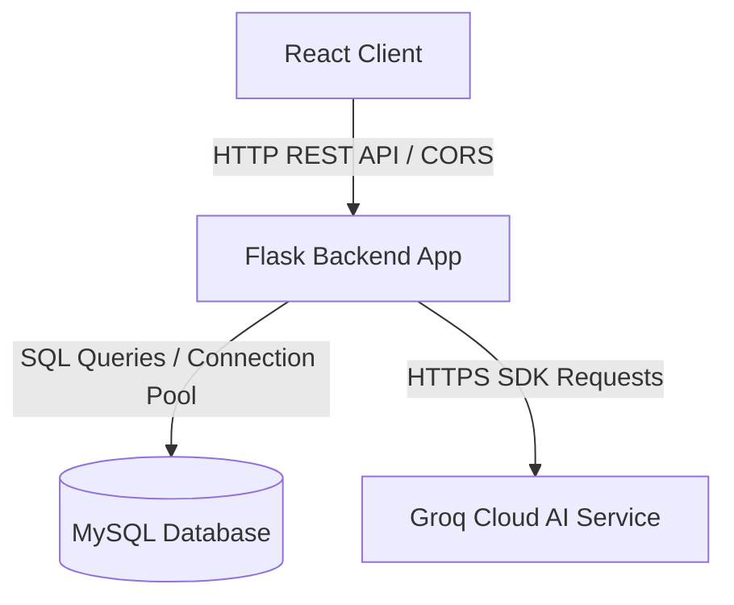

# 🏗️ System Design & Database Architecture

This document describes the architectural layout, database structures, security implementations, and backend calculation logic.

---

## 🗂️ High-Level System Architecture

Analytica uses a decoupled client-server architecture:



1.  **React Frontend**: Handles route rendering, tracks study page open time, displays glassmorphic dashboards using Chart.js, and requests dynamic quizzes.
2.  **Flask Python Backend**: Provides REST endpoints, performs user authentication, updates study activity tables, evaluates daily streaks, and queries the LLM service.
3.  **MySQL Database**: Persists student metadata, time logs, and test question histories.
4.  **Groq API**: Serves as the AI inference engine using the `openai/gpt-oss-120b` model.

---

## 💾 Database Schema

The system uses a relational database schema in MySQL named `web_analyzes` containing four tables.

### 1. `users` Table
Stores student accounts, login credentials, and gamification state.
*   `id` (INT, Primary Key, Auto-Increment)
*   `name` (VARCHAR(100), student's name)
*   `email` (VARCHAR(150), Unique Index, for login)
*   `course` (VARCHAR(100), active subject enrollment)
*   `password` (VARCHAR(255), stored securely as a salted hash)
*   `points` (INT, Default 0, total rewards accumulated)
*   `streak_count` (INT, Default 0, consecutive days studied)
*   `last_activity` (DATE, date of the last recorded study activity)
*   `created_at` (TIMESTAMP, defaults to current time)

### 2. `activity` Table
Tracks granular time spent by students on specific topics.
*   `id` (INT, Primary Key, Auto-Increment)
*   `user_id` (INT, Foreign Key referencing `users(id)` ON DELETE CASCADE)
*   `lesson_name` (VARCHAR(150), name of the topic studied, e.g. "C Basics")
*   `time_spent` (INT, duration in seconds)
*   `quiz_score` (DECIMAL(5,2), score earned on the topic quiz)
*   `device` (VARCHAR(50), browser or operating system string)
*   `created_at` (TIMESTAMP)

### 3. `question_history` Table
Stores previously generated and answered quiz questions.
*   `id` (INT, Primary Key, Auto-Increment)
*   `user_id` (INT, Foreign Key referencing `users(id)` ON DELETE CASCADE)
*   `topic` (VARCHAR(100), target topic)
*   `question_text` (TEXT, raw question text to feed the LLM context to prevent duplicate generation)
*   `created_at` (TIMESTAMP)

---

## 🛡️ Security: Password Hashing

In a production environment, storing raw text passwords is a severe vulnerability. The Flask backend uses Python's `werkzeug.security` module to manage password security:

1.  **Registration**:
    *   When a new user signs up, the backend accepts the raw password from the JSON payload.
    *   It calls `generate_password_hash(password)` which uses the default **scrypt** algorithm with a random salt to generate a secure, unidirectional hash string.
    *   The resulting 255-character hash is saved in the database.
2.  **Authentication**:
    *   During login, the backend fetches the stored hash based on the email.
    *   It calls `check_password_hash(stored_hash, input_password)`.
    *   This function extracts the salt from the stored hash, applies the hashing algorithm to the input password, and compares them in constant time to prevent timing attacks.

---

## 📅 Gamification & Daily Streak Calculation Logic

The streak engine rewards consistency. The backend calculates daily streaks during study logging via `/api/mark_answered` and `/api/activity`:

### Streak Logic Flow:
1.  When a study action occurs, the backend fetches the student's `last_activity` date and current `streak_count` from the `users` table.
2.  Let `today` be the current local date:
    *   **Case 1: First activity ever or streak was broken**
        If `last_activity` is `NULL` or more than 1 day ago (i.e. `today - last_activity > 1`), the student missed a study day.
        *   Action: Set `streak_count = 1`.
    *   **Case 2: Activity on the next consecutive day**
        If `last_activity` is exactly 1 day ago (i.e. `today - last_activity == 1`):
        *   Action: Set `streak_count = streak_count + 1`.
    *   **Case 3: Multiple activities on the same day**
        If `last_activity` is exactly `today`:
        *   Action: Keep `streak_count` unchanged (no need to double-increment on the same day).
3.  Update the `users` record: set `last_activity = today` and save the new `streak_count`.
4.  Award points: Each quiz completion adds **+20 points** to the user's score using an update query:
    ```sql
    UPDATE users SET points = points + 20 WHERE id = user_id;
    ```
